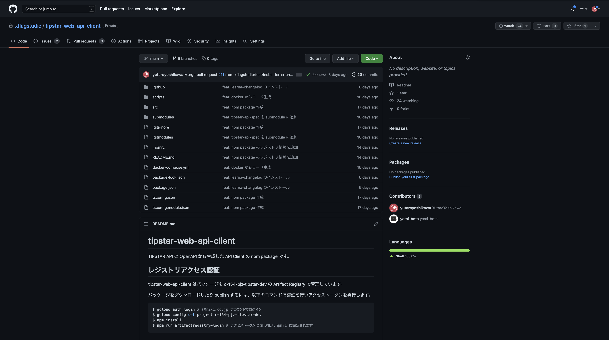

summary: api-client-npm-package
id: api-client-npm-package
categories: JS
status: Published
authors: yutaroyoshikawa
Feedback Link: https://github.com/yutaroyoshikawa/web-tutorial

# npm package を Artifact Registry にホスティングしようとしている話

## 目次

- 自己紹介
- 現状のプロジェクト構成
- api-client の課題点
- Artifact Registry とは？
- private registry に移すことのメリット
- Artifact Registry に npm package を移した後のプロジェクト変化
- Artifact Registry に移す過程で辛かったこと
- 学び

## 自己紹介

- 吉川勇太郎
- 21新卒 TIPSTAR 事業部の Web チーム
- Web フロントエンド 新卒研修講師担当・技術書展２つ書いた
- ミクシィ アドベントカレンダー書いた
- Web Components と WebGL が好き

## tipstar-web-api-client



tipstar-web-api-client という npm package を作っています。
TIPSTAR API と 通信するための API client
OpenAPI.yaml からソースコードを自動生成するようにしています。

### ポイント

- GitHub Actions で自動的にどんどんリリースされていく
  - まずは、GitHub Actions Workflow dispatch を使って手動で更新 Pull Request を作れるところから始める。
- Google Cloud の Artifact Registry に npm package がストアされる

## 現状のプロジェクト構成

- yarn workspace による monorepo 構成
  - app
    - アプリケーション本体
  - api-client
    - API クライアントパッケージ
  - esmodule-packages
    - ESM package を一旦 CommonJS に変換して、 Node.js 上でも扱えるようにしている。
  - combinatorics
    - esmodule-packages と同様
  - storybook-server
    - storybook をホスティングするための Express server
- api-spec リポジトリで OpenAPI.yaml を管理

## api-client の課題点

- AppEngine にデプロイするときのコード量上限に引っかかる
  - ビルドした成果物の必要なさそうなところを一部分 ignore したりあまりきれいではない…
- api-spec の更新ごとに、人力で api-client を更新するのが辛い
  - 機械生成した差分のレビューは省きたい
  - api-client 自体の更新と、それに伴う破壊的変更の対応を分離したい
- monorepo でのパッケージ管理だと、複数バージョンの管理ができないので api-client 自体の更新と、それに伴う破壊的変更の対応を分離しづらい。

```bash
packages/api-client/src/
packages/api-client/submodules/
packages/api-client/scripts/
packages/api-client/lib/models/
packages/api-client/lib/apis/
packages/api-client/module/models/
packages/api-client/module/apis/
```

## Artifact Registry とは？

- Google Cloud のサービスの一つ
- Docker コンテナや npm パッケージなどをストアすることができる
- IAM によるアクセス認証をかけることができるので、Google Cloud がメインのプロジェクトと相性がいい
  - Workload Identity を使えば、クレデンシャルファイルを GitHub リポジトリの secrets に置かずに認証できる。

## monorepo から private npm registry に移すことのメリット

- 複数バージョンをストアすることができるようになる
  - アプリケーションでは v1 をインストールしたままで、v1.1 の API クライアントを用意しておけるようになる
  - api-client 自体の更新と、それに伴う破壊的変更の対応を分離したい
- コードを常に別のレジストリから引っ張ってこれるのでデプロイ時にコードの実態がなくてもいい
  - Cloud Build 上で npm install されるので

## Artifact Registry に npm package を移した後のプロジェクト変化

- API client の更新を自動化することで、運用工数の削減
  - 破壊的変更の対応以外は機械的な作業なので自動化しやすい。

## Artifact Registry に移す過程で辛かったこと

- yarn の場合に コンフィグファイルの自動生成に対応していない
  - App Engine にデプロイしたときに内部的に Cloud Build で走る buildpacks というビルドツールが npm しかコンフィグファイルの認識に対応していない。
  - -> デプロイ時の CI で、あらかじめトークンを書き込んだ .npmrc ファイルを生成しておく

- GitHub Actions で作成した PR などをトリガーに別の Github Actions のワークフローを起動できない。
  - セキュリティ上の理由での仕様
  - -> Workload の完了などをトリガーにすることができるのでこれでやりたいことを実現できそう

## 学び

- GitHub Actions のデバッグと検証辛い
  - 手元で再現可能なスクリプトを書くように心がけるとメンテナンスやレビューしやすくなる
- gcloud コマンドでトークン生成ができたりするので、既存の Actions のリソースを活用しやすい
